# パーソナライズドAIニュースステーション — アーキテクチャ設計プラン (Rev.10)

## Context

自宅サーバー（svhome01 Docker LXC 103, 192.168.0.13）上で動くGo製バックエンドとして、ニュース収集・AI要約・音声合成・メディア管理・Web UI提供を担うシステムを設計する。

**音声再生は svhome02 のオーディオ端子から出力**。Home Assistant (192.168.0.21) が物理再生の責任を持ち、GoアプリはHA APIを逆コールする。Navidrome経由でFeishin/Symfoniumクライアントによるリモート再生も対応。管理画面は `https://news.futamura.dev` でCloudflare Tunnel経由で公開。

**音声再生の4経路:**
1. ATOM ECHO音声コマンド → HAオートメーション → GoアプリAPI → HA media_player → svhome02オーディオ端子
2. Lovelace Dashboardボタン → HAスクリプト → GoアプリAPI → HA media_player → svhome02オーディオ端子
3. 起床判定+モーションセンサ → HAオートメーション → GoアプリAPI → HA media_player → svhome02オーディオ端子
4. Navidrome (svhome02) → Feishin/Symfoniumクライアントで再生

**主要インフラ前提:**
- Go app: Docker on svhome01 LXC 103 (**192.168.0.13:8181**) ← ポート8080はScrutinyが使用中
- VOICEVOX: 同じDockerネットワーク上の別コンテナ (http://voicevox:50021)
- Navidrome: http://192.168.0.23:4533 (Sambaに保存したMP3を自動認識)
- Home Assistant: http://192.168.0.21:8123 (外部トリガー元 + メディア再生制御)
- Samba音楽共有: GoアプリがSMBクライアント (`github.com/hirochachacha/go-smb2`) で直接 `//192.168.0.22/Music` へMP3を書き込み・読み出し。HOST/LXC 103 へのシステム変更ゼロ
- Cloudflare Tunnel: svhome01 LXC 101経由で `news.futamura.dev` を公開
- **物理音声出力: GoアプリがHA REST APIを逆コール → svhome02のmedia_playerで再生**（aplay/ffplay OS execは不要）

**LXC 103 (192.168.0.13) のポート使用状況:**

| ポート | サービス | 備考 |
|---|---|---|
| 7900 | Selenium NoVNC | 既存 |
| **8080** | **Scrutiny Hub (Web UI + API)** | **使用中 → 競合回避必須** |
| 8086 | InfluxDB (Scrutiny用) | 既存 |
| 9000 | Portainer | 既存 |
| 50021 | VOICEVOX | 新規追加 |
| **8181** | **AI News Station** | **← 新規、競合回避のため8181を使用** |

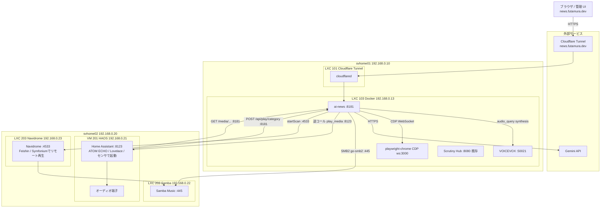

---

## 0. サーバー作業時の原則

**全てのサーバー作業はSSH経由で実施。ローカルマシンで直接コマンドを実行しない。**

```
svhome01 Proxmoxホスト作業:    ssh svhome01
docker-lxc (LXC 103) 直接作業: ssh svhome01-docker   ← ai-news の操作はこちらを使用
docker-lxc (pct経由) 作業:     ssh svhome01 → pct enter 103
svhome02 Proxmoxホスト作業:    ssh svhome02
```

---

## 1. ディレクトリ構成案

Standard Go Project Layout準拠。関心事を `domain / repository / usecase / infra / handler` の4層に分離。

### 1-0. サーバー上のディレクトリ配置

**ストレージ構造の整理（実サーバー環境に基づく）:**
- **svhome01 HOST SSD** (`HOST:/mnt/app_data/docker/`): ScrutinyおよびAI Newsのファイル群が物理配置。`pct set 103 -mp0 /mnt/app_data/docker,mp=/opt/stacks` によりdocker-lxcの `/opt/stacks/` としてbind mount。**ai-newsはlocal-lvm圧迫を避けるためHOST SSD側に配置**。
- **docker-lxc ローカルストレージ** (`/mnt/app_data/docker/`): docker-lxc (LXC 103) が持つ32GB local-lvmに存在。AppDaemon/Seleniumのみを配置。ai-newsはlocal-lvmを消費しない。`ssh svhome01-docker` で直接操作。
- **Samba書き込み・読み出し**: GoアプリがSMBクライアント (`github.com/hirochachacha/go-smb2`) で直接 `//192.168.0.22/Music` へ書き込む。HOST/LXC 103 へのシステム変更（cifs-utils・fstab・pct set）は一切不要。

```
■ svhome01 HOST (外付けSSD) ─────────────────────────────────────────
  /mnt/app_data/docker/              ← HOSTの外付けSSD上（docker-lxcの /mnt/ とは別物）
    ├── scrutiny/                    ← Scrutinyファイル群（HOST SSD上に物理配置）
    │   ├── docker-compose.yml       (SETUP_SERVER1.md Phase 4 で構築)
    │   ├── config/
    │   └── influxdb/
    └── ai-news/                    ← 新規（HOST SSD上に配置・local-lvm圧迫を回避）
        ├── docker-compose.yml
        ├── .env                     ← .gitignore対象
        ├── Dockerfile
        ├── go.mod
        ├── cmd/
        ├── internal/
        ├── migrations/
        ├── templates/
        └── data/                   ← .gitignore対象
            ├── news.db  (SQLite)
            └── thumbnails/          ← 記事サムネール画像（JPEG, リサイズ・クロップ済み）
  ↑ pct set 103 -mp0 /mnt/app_data/docker,mp=/opt/stacks でdocker-lxcにbind mount

■ docker-lxc (LXC 103, 192.168.0.13) ── ローカルストレージ (32GB local-lvm)
  /mnt/app_data/docker/              ← docker-lxc独自のローカルストレージ（既存スタック専用）
    └── svhome01-docker-appdaemon-selenium/  ← 既存 AppDaemon+Selenium スタック（変更不要）
    ※ ai-news は local-lvm を使わず /opt/stacks/ai-news/ (HOST SSD bind mount) に配置

  /opt/stacks/                      ← bind mount (HOST /mnt/app_data/docker → ここ)
    ├── scrutiny/                   ← 既存
    └── ai-news/                    ← 新規（git clone・docker compose up はここで実施）
        ├── docker-compose.yml
        ├── .env
        ├── Dockerfile
        ├── go.mod
        ├── cmd/
        ├── internal/
        ├── migrations/
        ├── templates/
        └── data/
            ├── news.db  (SQLite)
            └── thumbnails/          ← 記事サムネール画像（コンテナ内 /data/thumbnails/ にマウント済み）

■ svhome02 HOST (音楽ファイルの物理配置) ────────────────────────────
  /mnt/media_data/music/            ← 物理ストレージ（Sambaの共有元）
    └── ai-news/                    ← Goアプリが書き出すMP3の実体
        ├── tech/
        │   └── tech-news-20260226-morning.mp3
        └── business/
            └── business-news-20260226-morning.mp3
  ↑ //192.168.0.22/Music としてSamba共有 → LXC 203 (Navidrome) は /media/music にbind mount

■ ai-news Docker コンテナ (LXC 103内) ─── go-smb2 SMBクライアントで書き込み・読み出し
  ※ ローカルマウントポイント不要。GoアプリがSMBクライアントで直接 svhome02 Samba共有へMP3を書き込む
  ※ HTTP配信時もgo-smb2でSMBから読み出してレスポンスにストリーム
  ※ HOST/LXC 103 への追加インストール・設定変更ゼロ

※ パスチェーン: Goアプリ (go-smb2) → SMB over TCP (192.168.0.22:445/Music)
              → svhome02 HOST(/mnt/media_data/music/ai-news/)
              Navidrome(/media/music/ai-news/) → bind mount → 同上（同一物理パス）
※ SMB接続設定（SMB_HOST/SMB_USER/SMB_PASS/SMB_SHARE/SMB_MUSIC_PATH）は Goアプリの環境変数のみで管理
```

**事前準備:**

HOST/LXC 103 側のシステム変更は不要。cifs-utils・fstab・pct set mp1 は使用しない。

GoアプリがSMBクライアント (`go-smb2`) でネットワーク越しに直接 `//192.168.0.22/Music` へ書き込むため、Samba共有がネットワーク上でアクセス可能な状態であれば追加設定は不要。

### 1-1. Goアプリケーションのディレクトリ構成

```
ai-news/
├── cmd/
│   └── server/
│       └── main.go                   # エントリポイント: DI配線・HTTPサーバー起動・グレースフルシャットダウン
│
├── internal/
│   ├── domain/                       # ドメインモデル（外部依存なし）
│   │   ├── article.go                # Article構造体, Category/Status enum
│   │   ├── source.go                 # Source構造体, FetchMethod enum
│   │   ├── broadcast.go              # Broadcast構造体（カテゴリ単位の音声エピソード）
│   │   ├── pipeline.go               # PipelineRun構造体, RunStatus enum
│   │   └── errors.go                 # センチネルエラー定義
│   │
│   ├── repository/                   # SQLiteアクセス層
│   │   ├── db.go                     # DB open/close, WALモード設定, スキーママイグレーション
│   │   ├── article_repo.go           # ArticleRepository: CRUD, カテゴリ別一覧, 古いレコード削除
│   │   │                             # CountUnprocessed(category): broadcast_id IS NULLの件数取得
│   │   │                             # NullifyRawContent(days): 古い記事のraw_contentをNULLクリア（DBサイズ削減）
│   │   │                             #   ※ thumbnail_url は NullifyRawContent の対象外（UI表示用にレコード削除まで保持）
│   │   │                             # FindThumbnailsOlderThan(days): 削除対象記事の (id, thumbnail_url) を取得
│   │   │                             #   → cleanup_usecase.go が thumbnail_store.Delete を呼ぶための前処理
│   │   │                             # DeleteOlderThan(days): 古い記事レコードを削除
│   │   │                             #   ※ 必ず FindThumbnailsOlderThan → thumbnail_store.Delete の後に呼ぶこと
│   │   │                             # ※ broadcast_idのNULLクリアは ON DELETE SET NULL で自動処理
│   │   │                             #   (cleanup時にbroadcastを削除すれば自動でNULLになる)
│   │   ├── source_repo.go            # SourceRepository: CRUD, 有効ソース一覧
│   │   │                             # ※ Update()では updated_at = strftime('%Y-%m-%dT%H:%M:%SZ','now') を明示指定
│   │   ├── broadcast_repo.go         # BroadcastRepository: CRUD, カテゴリ別最新取得, 古いもの削除
│   │   ├── pipeline_repo.go          # PipelineRunRepository: 実行記録, ステップ更新, 履歴一覧
│   │   │                             # ※ pipeline_runsはcleanup対象外（意図的設計）
│   │   │                             #   ホームサーバー規模(数件/日)では無限増殖しても実用上問題なし
│   │   ├── settings_repo.go          # SettingsRepository: Get (id=1固定), Update
│   │   │                             # ※ Update()では updated_at = strftime('%Y-%m-%dT%H:%M:%SZ','now') を明示指定
│   │   ├── category_repo.go          # CategoryRepository: CRUD, ListEnabled(sort_order順)
│   │   └── schedule_repo.go          # ScheduleRepository: CRUD, ListByType(scrape|generate)
│   │
│   ├── usecase/                      # ビジネスロジック
│   │   ├── pipeline_usecase.go       # ScrapeUsecase (Stage1) + GenerateUsecase (Stage2-7)・独立atomic.Bool排他制御
│   │   ├── source_usecase.go         # ソースCRUD操作
│   │   ├── article_usecase.go        # 記事一覧・取得
│   │   ├── playback_usecase.go       # 最新Broadcast取得 → HA APIへmedia_player.play_media呼び出し
│   │   ├── settings_usecase.go       # app_settings の取得・更新
│   │   ├── category_usecase.go       # category_settings のCRUD・VOICEVOX話者一覧取得
│   │   │                             # ※ CreateCategory()で予約語バリデーション → 400エラー
│   │   │                             #   "stop"  : /api/play/stop とのルーティング競合（exact match優先）
│   │   │                             #   "digest": Stage 6でシステムが自動生成するbroadcast categoryと衝突
│   │   ├── schedule_usecase.go       # schedules のCRUD・cron再登録トリガー
│   │   └── cleanup_usecase.go        # 7日以上経過したBroadcast+SMB上MP3+記事の削除
│   │                                 # ※ 削除順序: broadcastRepo.DeleteByIDs → (ON DELETE SET NULL自動適用)
│   │                                 #   → articleRepo.DeleteOlderThan
│   │                                 # ※ pipeline_runsはcleanup対象外（意図的）
│   │
│   ├── infra/                        # 外部サービス連携実装
│   │   ├── scraper/
│   │   │   ├── factory.go            # FetchMethodに応じたFetcher生成
│   │   │   ├── rss_fetcher.go        # gofeed: RSS/Atomパース
│   │   │   │                         # リモートサムネールURL取得: feed.Items[i].Image.URL / enclosure(image/*) / media:thumbnail を優先順に検索
│   │   │   │                         # → 取得したリモートURLを thumbnail.store.DownloadAndSave に渡してローカル保存
│   │   │   ├── http_fetcher.go       # goquery: 静的HTML取得・パース
│   │   │   │                         # リモートサムネールURL取得: <meta property="og:image"> の content 属性を取得
│   │   │   │                         # → 取得したリモートURLを thumbnail.store.DownloadAndSave に渡してローカル保存
│   │   │   └── playwright_fetcher.go # playwright-go: ConnectOverCDP(PLAYWRIGHT_CDP_ENDPOINT)
│   │   │                             # で playwright-chrome コンテナのChromiumへリモート接続
│   │   │                             # リモートサムネールURL取得: document.querySelector('meta[property="og:image"]').content
│   │   │                             # → 取得したリモートURLを thumbnail.store.DownloadAndSave に渡してローカル保存
│   │   │                             # ※ いずれのFetcherも取得失敗時はthumbnail_url=NULLとして記事を保存（非致命的）
│   │   ├── gemini/
│   │   │   └── client.go             # Gemini API: 記事選定・DJスクリプト生成（JSON mode）
│   │   │                             # withRetry: 429時は指数バックオフでリトライ
│   │   ├── voicevox/
│   │   │   └── client.go             # VOICEVOX REST: /audio_query → /synthesis → WAVバイト列
│   │   ├── audio/
│   │   │   └── converter.go          # ffmpeg: WAV→MP3変換 + id3v2タグ付与
│   │   │                             # ffprobe: duration_sec 取得
│   │   │                             # ConcatMP3(tmpDir, inputs, output): digest連結
│   │   │                             #   tmpDir は os.MkdirTemp("","ai-news-digest-*") で生成
│   │   │                             #   呼び出し元 (pipeline_usecase.go) が defer os.RemoveAll(tmpDir)
│   │   │                             # ※ player.go は不要（HA側が再生制御）
│   │   ├── homeassistant/
│   │   │   └── client.go             # HA REST API逆コール: media_player.play_media / stop
│   │   ├── navidrome/
│   │   │   └── client.go             # Navidrome Subsonic API: /rest/startScan
│   │   │                             # Subsonic認証: u/t/s/v/c クエリパラメータ
│   │   │                             #   t = md5(password + salt)  ← Bearer/Basic不可
│   │   │                             #   s = ランダムソルト（リクエスト毎に生成）
│   │   │                             #   v = "1.16.1", c = "ai-news"
│   │   ├── thumbnail/
│   │   │   └── store.go              # サムネール取得・リサイズ・クロップ・ローカル保存・削除
│   │   │                             # DownloadAndSave(articleID int, remoteURL string) (localPath string, err error)
│   │   │                             #   → HTTP GET でリモート画像を取得
│   │   │                             #   → imaging.Fill(img, 320, 180, imaging.Center) でリサイズ+センタークロップ (16:9)
│   │   │                             #   → JPEG エンコード → /data/thumbnails/{articleID}.jpg に保存
│   │   │                             #   → 戻り値: "/thumbnails/{articleID}.jpg"（HTTPサービングパス）
│   │   │                             # Delete(articleID int) error
│   │   │                             #   → os.Remove("/data/thumbnails/{articleID}.jpg")
│   │   │                             # ※ 起動時に /data/thumbnails/ ディレクトリが存在しない場合は os.MkdirAll で自動作成
│   │   └── storage/
│   │       └── music_store.go        # go-smb2: SMBダイアル→認証→共有マウント→MP3書き込み・読み出し・削除
│   │                                 # SaveMP3(filePath, data): SMB共有へMP3を書き込む
│   │                                 # StreamMP3(w http.ResponseWriter, filePath): SMBから読み出しHTTPストリーム
│   │                                 # DeleteMP3(filePath): SMBからMP3を削除
│   │                                 # 環境変数: SMB_HOST/SMB_USER/SMB_PASS/SMB_SHARE/SMB_MUSIC_PATH
│   │
│   ├── handler/
│   │   ├── middleware.go             # リクエストログ, panic recovery, request-ID付与
│   │   ├── web/                      # Web UI ハンドラ（html/template + HTMX）
│   │   │   ├── dashboard.go          # GET / および HTMX記事一覧フラグメント
│   │   │   ├── sources.go            # ソースCRUD UI ハンドラ
│   │   │   ├── settings.go           # GET /ui/settings, POST /ui/settings → 設定表示・更新
│   │   │   └── system.go             # システム制御UI（手動実行・スキャン・クリーンアップ・ログ表示）
│   │   └── api/                      # 外部REST APIハンドラ（JSON）
│   │       ├── play.go               # POST /api/play/{category}, /api/play/stop
│   │       │                         # {category} をDB照合して動的にbroadcast取得・HA再生
│   │       ├── broadcast.go          # GET /api/broadcasts → カテゴリ別最新一覧
│   │       ├── media.go              # GET /media/{category}/latest, /media/{category}/{id}
│   │       │                         # go-smb2でSMBからMP3を読み出してHTTPストリームで配信
│   │       ├── pipeline.go           # POST /api/pipeline/run, GET /api/pipeline/{id}
│   │       ├── voicevox.go           # GET /api/voicevox/speakers → VOICEVOX話者一覧プロキシ（設定UI用）
│   │       └── health.go             # GET /api/health
│   │
│   ├── scheduler/
│   │   └── scheduler.go              # robfig/cron v3: パイプライン定期実行・クリーンアップ登録
│   │
│   └── config/
│       └── config.go                 # 環境変数読み込み（godotenv）
│
├── migrations/
│   └── 001_initial.sql               # CREATE TABLE 全DDL（//go:embed でバイナリに同梱）
│
├── templates/
│   ├── layout.html                   # ベースレイアウト（Pico.css CDN + HTMX CDN）
│   ├── dashboard.html                # Tech/Businessタブ + 記事一覧 + <audio>タグ
│   ├── sources.html                  # ソース管理ページ
│   ├── settings.html                 # 設定ページ（articles_per_episode / summary_chars_per_article）
│   ├── system.html                   # システム制御ページ
│   ├── partials/
│   │   ├── article_list.html         # HTMX swapターゲット: 記事カードリスト（thumbnail_url があれば記事カードに画像表示）
│   │   ├── source_row.html           # インライン編集可能ソース行
│   │   ├── pipeline_status.html      # パイプライン実行状況バッジ（ポーリング用）
│   │   └── settings_form.html        # HTMX swapターゲット: 設定フォーム（保存後に更新）
│   └── error.html
│
├── Dockerfile                        # マルチステージ: builder(Go 1.22) + runtime(debian:bookworm-slim)
│                                     # ENTRYPOINT ["./entrypoint.sh"] で起動時 /data chown を実行
│                                     # ※ Playwright依存は playwright-chrome コンテナに分離済みのため不要
│                                     # ※ migrations は //go:embed でバイナリ同梱済み → COPY 不要
├── entrypoint.sh                     # 起動時に /data の所有者を修正 → SQLite WALファイル書き込み権限確保
├── docker-compose.yml                # ai-news + voicevox + playwright-chrome
├── .env.example                      # GEMINI_API_KEY, HA_URL, HA_TOKEN, NAVIDROME_*, SMB_HOST, SMB_USER, SMB_PASS 等
└── go.mod
```

**主要依存ライブラリ:**

| ライブラリ | 用途 |
|---|---|
| `github.com/robfig/cron/v3` | Cronスケジューラ |
| `modernc.org/sqlite` | SQLiteドライバ（pure Go・CGO不要・Dockerビルドが簡潔） |
| `github.com/mmcdole/gofeed` | RSS/Atomパース |
| `github.com/PuerkitoBio/goquery` | HTML解析 |
| `github.com/playwright-community/playwright-go` | JS動的サイト取得（ConnectOverCDPでリモートChromium接続） |
| `google.golang.org/genai` | Gemini公式Go SDK |
| `github.com/bogem/id3v2/v2` | MP3 ID3タグ付与 |
| `github.com/hirochachacha/go-smb2` | SMB2クライアント（Samba書き込み・読み出し・削除・CGO不要） |
| `github.com/disintegration/imaging` | 画像リサイズ・クロップ（サムネール生成） |
| `github.com/joho/godotenv` | `.env`読み込み |
| 標準 `net/http` (Go 1.22) | HTTPルーター |

**Goレイヤー依存関係:**

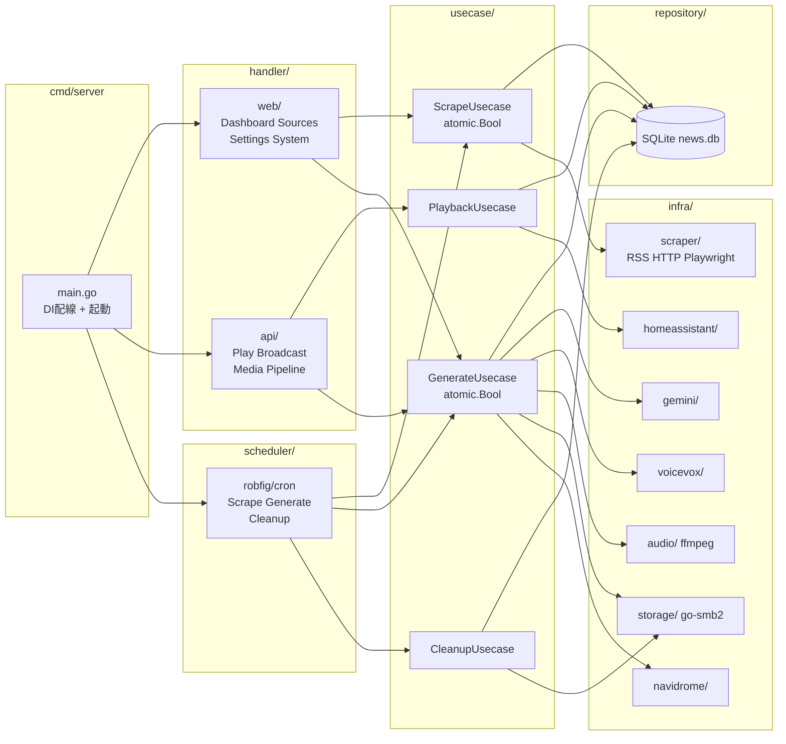

---

## 2. データベーススキーマ設計

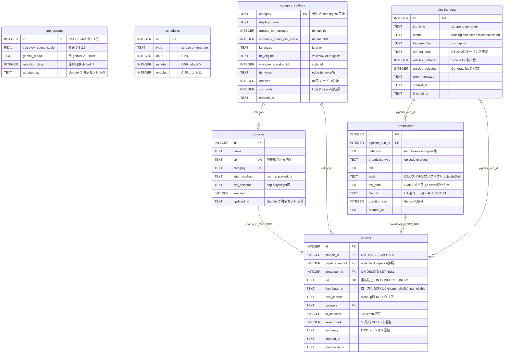

```sql
-- migrations/001_initial.sql
-- テーブル定義順序: 依存関係に従い pipeline_runs → sources → broadcasts → articles の順に定義
PRAGMA journal_mode = WAL;
PRAGMA foreign_keys = ON;

-- ── app_settings: アプリ設定（1行のみ、依存なし、最初に定義）──────
-- CHECK (id = 1) で複数行挿入を禁止。INSERTはOR IGNOREで冪等性を保証
CREATE TABLE IF NOT EXISTS app_settings (
    id                   INTEGER PRIMARY KEY CHECK (id = 1),
    voicevox_speed_scale REAL    NOT NULL DEFAULT 1.0,              -- 話速 (0.5〜2.0)
    gemini_model         TEXT    NOT NULL DEFAULT 'gemini-2.0-flash', -- Gemini APIモデル名
    retention_days       INTEGER NOT NULL DEFAULT 7,                -- 記事・MP3・DBの保持日数
    updated_at           TEXT    NOT NULL DEFAULT (strftime('%Y-%m-%dT%H:%M:%SZ', 'now'))
    -- スケジュール設定は schedules テーブルで管理（追加・削除が自由な独立テーブル）
    -- ※ updated_at はSQLiteのON UPDATE非対応のため、settings_repo.goのUpdate()で明示セット必須
);
INSERT OR IGNORE INTO app_settings (id) VALUES (1);                 -- 初期レコードを冪等挿入

-- ── schedules: クロール・音声生成の実行時刻（追加・削除が自由）──────────
-- scrape: 記事クロール専用ジョブの実行時刻
-- generate: 音声生成専用ジョブの実行時刻（Gemini選定→TTS→MP3保存）
-- 各エントリがそのまま独立したcronジョブ (0 {minute} {hour} * * *) として登録される
CREATE TABLE IF NOT EXISTS schedules (
    id      INTEGER PRIMARY KEY AUTOINCREMENT,
    type    TEXT    NOT NULL CHECK (type IN ('scrape', 'generate')),
    hour    INTEGER NOT NULL CHECK (hour >= 0 AND hour <= 23),
    minute  INTEGER NOT NULL DEFAULT 0 CHECK (minute >= 0 AND minute <= 59),
    enabled INTEGER NOT NULL DEFAULT 1,           -- 0=一時停止, 1=有効
    UNIQUE (type, hour, minute)                   -- 同一種別・同一時刻の重複防止
);
CREATE INDEX IF NOT EXISTS idx_schedules_type_enabled ON schedules (type, enabled);
-- クロール初期設定: 1時間ごと (毎時)
INSERT OR IGNORE INTO schedules (type, hour) VALUES
    ('scrape',  0), ('scrape',  1), ('scrape',  2), ('scrape',  3),
    ('scrape',  4), ('scrape',  5), ('scrape',  6), ('scrape',  7),
    ('scrape',  8), ('scrape',  9), ('scrape', 10), ('scrape', 11),
    ('scrape', 12), ('scrape', 13), ('scrape', 14), ('scrape', 15),
    ('scrape', 16), ('scrape', 17), ('scrape', 18), ('scrape', 19),
    ('scrape', 20), ('scrape', 21), ('scrape', 22), ('scrape', 23);
-- 音声生成初期設定: 朝・昼・夕
INSERT OR IGNORE INTO schedules (type, hour) VALUES
    ('generate',  6), ('generate',  7), ('generate',  8),
    ('generate', 11), ('generate', 12), ('generate', 13),
    ('generate', 18), ('generate', 19), ('generate', 20), ('generate', 23);

-- ── category_settings: カテゴリごとの設定（拡張可能）────────────────
-- 新カテゴリ追加はここにINSERT + sourcesにURLを登録するだけでパイプラインに自動組み込み
-- sort_orderはUI表示順・パイプライン処理順・digest連結順に使用
-- ── 予約語 (category_usecase.goのCreateCategory()でバリデーション → 400エラー) ──
--   "stop"  : POST /api/play/stop とルーティング競合（Go 1.22 ServeMux はexact matchが優先）
--   "digest": GenerateJob Stage 6がcategory='digest'でbroadcastを自動生成するため
--             ユーザー定義カテゴリと混在するとGetLatest/クリーンアップが誤動作する
CREATE TABLE IF NOT EXISTS category_settings (
    category                  TEXT    PRIMARY KEY,               -- 'tech', 'business', 新カテゴリ等
    display_name              TEXT    NOT NULL,                  -- UI表示名: 'テックニュース' 等
    articles_per_episode      INTEGER NOT NULL DEFAULT 10,       -- 1エピソードの記事数
    summary_chars_per_article INTEGER NOT NULL DEFAULT 200,      -- 1記事あたりの要約文字数
    language                  TEXT    NOT NULL DEFAULT 'ja'
                                      CHECK (language IN ('ja', 'en')),    -- 要約・音声の言語
    tts_engine                TEXT    NOT NULL DEFAULT 'voicevox'
                                      CHECK (tts_engine IN ('voicevox', 'edge-tts')), -- TTSエンジン選択
    voicevox_speaker_id       INTEGER NOT NULL DEFAULT 3,        -- VOICEVOXのstyle_id (tts_engine='voicevox'時)
    tts_voice                 TEXT,                              -- edge-tts voice名 e.g. 'en-US-GuyNeural' (tts_engine='edge-tts'時)
    enabled                   INTEGER NOT NULL DEFAULT 1,        -- 0=スキップ, 1=パイプライン実行対象
    sort_order                INTEGER NOT NULL DEFAULT 0,        -- UI表示順・digest連結順
    created_at                TEXT    NOT NULL DEFAULT (strftime('%Y-%m-%dT%H:%M:%SZ', 'now'))
);
CREATE INDEX IF NOT EXISTS idx_category_settings_enabled    ON category_settings (enabled);
CREATE INDEX IF NOT EXISTS idx_category_settings_sort_order ON category_settings (sort_order);
-- 初期カテゴリ: tech (ずんだもん ノーマル, style_id=3) / business (四国めたん ノーマル, style_id=2)
-- 英語カテゴリは後で追加: INSERT INTO category_settings (...) VALUES ('tech_en', ..., 'en', 'edge-tts', 3, 'en-US-GuyNeural', 1, 3)
INSERT OR IGNORE INTO category_settings
    (category, display_name, language, tts_engine, voicevox_speaker_id, sort_order) VALUES
    ('tech',     'テックニュース',     'ja', 'voicevox', 3, 1),
    ('business', 'ビジネスニュース', 'ja', 'voicevox', 2, 2);

-- ── pipeline_runs: パイプライン実行履歴（依存なし）─────────────────
-- ※ cleanup対象外（意図的設計）。ホームサーバー規模では無限増殖しても実用上問題なし
CREATE TABLE IF NOT EXISTS pipeline_runs (
    id                 INTEGER PRIMARY KEY AUTOINCREMENT,
    job_type           TEXT    NOT NULL DEFAULT 'generate'
                               CHECK (job_type IN ('scrape', 'generate')), -- scrape=クロールのみ, generate=音声生成のみ
    status             TEXT    NOT NULL DEFAULT 'running'
                               CHECK (status IN ('running', 'completed', 'failed', 'cancelled')),
    triggered_by       TEXT    NOT NULL DEFAULT 'cron'
                               CHECK (triggered_by IN ('cron', 'api', 'ui')),
    current_step       TEXT,                             -- UI進捗表示用 ('scrape','select','tts','encode','store')
    articles_collected INTEGER,                          -- ScrapeJobが収集した件数
    articles_selected  INTEGER,                          -- GenerateJobがGeminiで選定した件数（0=処理対象なし）
    error_message      TEXT,
    started_at         TEXT    NOT NULL DEFAULT (strftime('%Y-%m-%dT%H:%M:%SZ', 'now')),
    finished_at        TEXT
);
CREATE INDEX IF NOT EXISTS idx_pipeline_runs_status     ON pipeline_runs (status);
CREATE INDEX IF NOT EXISTS idx_pipeline_runs_started_at ON pipeline_runs (started_at DESC);

-- ── sources: スクレイピング対象ソース（依存なし）────────────────
CREATE TABLE IF NOT EXISTS sources (
    id           INTEGER PRIMARY KEY AUTOINCREMENT,
    name         TEXT    NOT NULL,                       -- 表示名 (例: "Hacker News RSS")
    url          TEXT    NOT NULL UNIQUE,
    category     TEXT    NOT NULL REFERENCES category_settings(category),  -- 有効カテゴリはcategory_settingsで管理
    fetch_method TEXT    NOT NULL CHECK (fetch_method IN ('rss', 'http', 'playwright')),
    css_selector TEXT,                                   -- http/playwright用: 記事リンクCSSセレクタ
    enabled      INTEGER NOT NULL DEFAULT 1,             -- 0=無効, 1=有効
    created_at   TEXT    NOT NULL DEFAULT (strftime('%Y-%m-%dT%H:%M:%SZ', 'now')),
    updated_at   TEXT    NOT NULL DEFAULT (strftime('%Y-%m-%dT%H:%M:%SZ', 'now'))
    -- ※ updated_at はSQLiteのON UPDATE非対応のため、source_repo.goのUpdate()で明示セット必須
    --    例: UPDATE sources SET name=?, ..., updated_at=strftime('%Y-%m-%dT%H:%M:%SZ','now') WHERE id=?
);
CREATE INDEX IF NOT EXISTS idx_sources_category ON sources (category);
CREATE INDEX IF NOT EXISTS idx_sources_enabled  ON sources (enabled);

-- ── broadcasts: 音声エピソード（pipeline_runsに依存）─────────────────
-- episode: 1パイプライン実行 × 1カテゴリ = 1レコード
-- digest:  全カテゴリをsort_order順に連結した合成エピソード = 1パイプライン実行に1レコード
CREATE TABLE IF NOT EXISTS broadcasts (
    id              INTEGER PRIMARY KEY AUTOINCREMENT,
    pipeline_run_id INTEGER NOT NULL REFERENCES pipeline_runs(id),
    category        TEXT    NOT NULL,        -- 'tech', 'business' 等 or 'digest'（全連結）
    broadcast_type  TEXT    NOT NULL DEFAULT 'episode'
                            CHECK (broadcast_type IN ('episode', 'digest')),
    title           TEXT    NOT NULL,        -- "Tech News - 2026-02-26 朝" 等
    script          TEXT,                    -- DJスタイル全文スクリプト（N記事連結, episodeのみ）
    file_path       TEXT    NOT NULL,        -- SMB共有内の相対パス（go-smb2での読み書き・削除キー）
                                             -- 例: ai-news/tech/tech-news-20260226-morning.mp3
                                             -- SMB_SHARE/{file_path} がSambaサーバー上の実体パス
    file_url        TEXT,                    -- GoアプリのHTTP URL (http://192.168.0.13:8181/media/tech/{id})
                                             -- HA逆コール用・Web UIの<audio>タグのsrc経由で使用
    duration_sec    INTEGER,                 -- 音声長さ（秒）: ffprobeで取得後にDB記録
    created_at      TEXT    NOT NULL DEFAULT (strftime('%Y-%m-%dT%H:%M:%SZ', 'now'))
);
CREATE INDEX IF NOT EXISTS idx_broadcasts_category   ON broadcasts (category);
CREATE INDEX IF NOT EXISTS idx_broadcasts_type       ON broadcasts (broadcast_type);
CREATE INDEX IF NOT EXISTS idx_broadcasts_created_at ON broadcasts (created_at DESC);

-- ── articles: 収集・処理済み記事（sources / pipeline_runs / broadcasts に依存）
CREATE TABLE IF NOT EXISTS articles (
    id              INTEGER PRIMARY KEY AUTOINCREMENT,
    source_id       INTEGER NOT NULL REFERENCES sources(id) ON DELETE CASCADE,
    pipeline_run_id INTEGER REFERENCES pipeline_runs(id),  -- ScrapeJobのrun_id（記事を収集したScrapeジョブへの参照）
                                                           -- GenerateJob実行時は更新しない
    broadcast_id    INTEGER REFERENCES broadcasts(id) ON DELETE SET NULL,
                                                           -- ON DELETE SET NULL:
                                                           --   broadcasts削除時にNULLクリア（FK制約違反防止）
                                                           --   cleanup_usecase.goはbroadcast削除→article削除の順で実施
                                                           --   SQLiteが自動でNULLに更新するため明示的な前処理不要
    title           TEXT    NOT NULL,
    url             TEXT    NOT NULL UNIQUE,               -- 重複取り込み防止キー
    thumbnail_url   TEXT,                                  -- サムネール配信パス（例: /thumbnails/42.jpg）
                                                           -- nullable: リモート画像が取得できない記事は NULL
                                                           -- スクレイプ時に og:image / RSS media:thumbnail のURLを取得し
                                                           -- thumbnail.store.DownloadAndSave でリサイズ・クロップ後に
                                                           -- /data/thumbnails/{articleID}.jpg としてローカル保存
                                                           -- → DBには HTTPサービングパス "/thumbnails/{id}.jpg" を格納
                                                           -- → 記事削除時は thumbnail.store.Delete で実ファイルも削除必須
    raw_content     TEXT,                                  -- スクレイプ本文（処理後にNULLクリア可）
    category        TEXT    NOT NULL REFERENCES category_settings(category),  -- 有効カテゴリはcategory_settingsで管理
    is_selected     INTEGER NOT NULL DEFAULT 0,            -- 1=Geminiが選定したTop10
    select_rank     INTEGER,                               -- 話題性ランキング (1=最も高い〜10=最も低い, NULL=未選定)
    summary         TEXT,                                  -- 個別記事のDJ原稿（Gemini生成）
    created_at      TEXT    NOT NULL DEFAULT (strftime('%Y-%m-%dT%H:%M:%SZ', 'now')),
    processed_at    TEXT                                   -- broadcast_idが設定された時刻
);
CREATE INDEX IF NOT EXISTS idx_articles_category       ON articles (category);
CREATE INDEX IF NOT EXISTS idx_articles_is_selected    ON articles (is_selected);
CREATE INDEX IF NOT EXISTS idx_articles_created_at     ON articles (created_at);
CREATE INDEX IF NOT EXISTS idx_articles_pipeline_run   ON articles (pipeline_run_id);
CREATE INDEX IF NOT EXISTS idx_articles_broadcast      ON articles (broadcast_id);
CREATE INDEX IF NOT EXISTS idx_articles_select_rank    ON articles (select_rank);
```

**スキーマ設計のポイント:**
- `app_settings` は常に1行のみ (`CHECK (id = 1)`)。グローバル設定（話速・Geminiモデル・保持日数）をWeb UIから変更。スケジュール設定は `schedules` テーブルで独立管理
- `schedules` テーブルが scrape/generate ジョブの実行時刻を管理。各行が独立したcronジョブ `0 {minute} {hour} * * *` として登録。スケジュールのCRUD操作後はScheduler.ReloadAll() が全cronジョブをRemove→再登録。`UNIQUE(type, hour, minute)` で同一時刻の重複登録を防ぐ
- `category_settings` が有効カテゴリの定義テーブル。`sort_order` 順にパイプライン処理・digest連結を実施。`language`/`tts_engine`/`tts_voice` で将来の英語TTS（edge-tts）にも対応可能。新カテゴリはINSERT + sources登録のみで自動組み込み
- **予約語 `"stop"` / `"digest"`**: `"stop"` はルーティング競合のため、`"digest"` はStage 6の自動生成broadcastとの混在を防ぐため、`category_usecase.go` のCreateCategory()でバリデーション拒否
- `broadcasts.file_path` はSMB共有内の相対パス（例: `ai-news/tech/filename.mp3`）。go-smb2でのSaveMP3・StreamMP3・DeleteMP3の操作キーとして使用。`SMB_SHARE/{file_path}` がSamba上の実体パスに対応
- `broadcasts.file_url` はHA用LAN URL (`http://192.168.0.13:8181/media/...`)。Web UIの `<audio src>` はハンドラ側でリクエストHostヘッダから動的生成（Cloudflare Tunnel対応）
- `broadcasts.duration_sec` はffmpeg変換後にffprobeで取得してDB記録（例: `ffprobe -v error -show_entries format=duration -of default=noprint_wrappers=1:nokey=1 out.mp3`）
- `articles.pipeline_run_id` はScrapeJobのrun_idを参照（記事を収集したジョブ）。GenerateJob実行時には更新しない。GenerateJobの選定件数は `pipeline_runs.articles_selected` に記録
- `articles.url UNIQUE` により同一記事の重複取り込みを防ぐ（`ON CONFLICT IGNORE`で冪等INSERT）
- `articles.thumbnail_url` はローカルに保存したサムネール画像の配信パス（例: `/thumbnails/42.jpg`）。スクレイプ時に og:image / RSS `<media:thumbnail>` 等のリモートURLを取得し、`thumbnail.store.DownloadAndSave` で 320×180px（16:9）にリサイズ・センタークロップしてJPEGとして `/data/thumbnails/{articleID}.jpg` に保存。DBにはHTTPサービングパスを格納。記事削除時は `thumbnail.store.Delete` で実ファイルも削除する（`articleRepo.DeleteOlderThan` の前に実施）。`NullifyRawContent` の対象外（UI表示用にレコード削除まで保持）
- `articles.select_rank` でGeminiが選定した話題性順位を保持 → DJスクリプト生成・音声合成の順序制御に使用
- `articles.broadcast_id ON DELETE SET NULL` により、broadcasts削除時にarticlesの参照が自動でNULLクリア。FK制約違反を防ぎつつ記事自体は保持。cleanup_usecase.goでの明示的な前処理は不要
- `pipeline_runs.current_step` をHTMX側が3秒ポーリング → 進捗リアルタイム表示（SSE不要）
- `raw_content` はクリーンアップ時にNULLクリアしてDBサイズを抑制
- `pipeline_runs` はcleanup対象外（意図的設計）。ホームサーバー規模（数件/日）では実用上問題なし
- `updated_at` カラム（`sources`, `app_settings`）はSQLiteに `ON UPDATE` トリガー機能がないため、各リポジトリの `Update()` メソッドで `updated_at = strftime('%Y-%m-%dT%H:%M:%SZ','now')` を明示セット

---

## 3. API・ルーティング設計

Go 1.22の標準 `net/http` のメソッドプレフィックスパターンを使用。

### Web UI ルート（HTMXが叩く・HTMLを返す）

| Method | Path | ハンドラ | 説明 |
|---|---|---|---|
| `GET` | `/` | `web.DashboardHandler.Index` | ダッシュボード全ページ（デフォルト: techタブ） |
| `GET` | `/ui/articles` | `web.DashboardHandler.ArticleList` | HTMX: 記事リストフラグメント `?category=tech&days=7` |
| `GET` | `/ui/sources` | `web.SourceHandler.List` | ソース管理ページ |
| `POST` | `/ui/sources` | `web.SourceHandler.Create` | ソース新規作成 → 行フラグメント返却 |
| `GET` | `/ui/sources/{id}/edit` | `web.SourceHandler.EditForm` | インライン編集フォームフラグメント |
| `PUT` | `/ui/sources/{id}` | `web.SourceHandler.Update` | ソース更新 → 更新済み行フラグメント |
| `DELETE` | `/ui/sources/{id}` | `web.SourceHandler.Delete` | ソース削除 → 空レスポンス（HTMX行削除） |
| `GET` | `/ui/system` | `web.SystemHandler.Index` | システムページ（直近20件の実行ログ+操作ボタン） |
| `POST` | `/ui/pipeline/trigger` | `web.SystemHandler.TriggerPipeline` | 手動ジョブ実行（`?job_type=scrape\|generate`、省略時は`generate`）→ run_idをHTMXに返す |
| `GET` | `/ui/pipeline/{id}/status` | `web.SystemHandler.PipelineStatus` | HTMX 3秒ポーリング用ステータスバッジ |
| `POST` | `/ui/navidrome/scan` | `web.SystemHandler.NavidromeScan` | Navidrome強制スキャン → 結果フラグメント |
| `POST` | `/ui/system/cleanup` | `web.SystemHandler.TriggerCleanup` | クリーンアップ手動実行（retention_days超過分の記事・MP3削除）→ 結果フラグメント |
| `GET` | `/ui/settings` | `web.SettingsHandler.Index` | 設定ページ（グローバル設定 + カテゴリ設定テーブル + VOICEVOX話者ドロップダウン） |
| `POST` | `/ui/settings` | `web.SettingsHandler.Update` | グローバル設定保存 → フォームフラグメント返却 |
| `POST` | `/ui/categories` | `web.SettingsHandler.CreateCategory` | 新規カテゴリ追加 → テーブル行フラグメント |
| `PUT` | `/ui/categories/{category}` | `web.SettingsHandler.UpdateCategory` | カテゴリ設定更新 → 行フラグメント |
| `DELETE` | `/ui/categories/{category}` | `web.SettingsHandler.DeleteCategory` | カテゴリ削除（broadcasts/sources/articles 存在時は409拒否） |
| `POST` | `/ui/schedules` | `web.SettingsHandler.CreateSchedule` | スケジュール追加（type/hour/minute）→ 行フラグメント返却 + Scheduler再登録 |
| `PUT` | `/ui/schedules/{id}` | `web.SettingsHandler.ToggleSchedule` | スケジュール有効/無効切り替え → 行フラグメント更新 + Scheduler再登録 |
| `DELETE` | `/ui/schedules/{id}` | `web.SettingsHandler.DeleteSchedule` | スケジュール削除 → 空レスポンス（HTMX行削除）+ Scheduler再登録 |
| `GET` | `/static/` | `http.FileServer` | 静的ファイル配信 |
| `GET` | `/thumbnails/{filename}` | `http.FileServer` | サムネール画像配信（`/data/thumbnails/` ディレクトリを配信）`Content-Type: image/jpeg` |

### メディア配信ルート（音声ファイルHTTP配信）

| Method | Path | ハンドラ | 説明 |
|---|---|---|---|
| `GET` | `/media/{category}/latest` | `api.MediaHandler.ServeLatest` | 最新ブロードキャストのMP3をHTTPストリームで配信。broadcasts.file_pathをキーにgo-smb2でSMBから読み出し → io.Copy → レスポンス（`Content-Type: audio/mpeg`）。Web UIの `<audio>` タグ・HA の `media_content_id` に使用 |
| `GET` | `/media/{category}/{id}` | `api.MediaHandler.ServeByID` | 指定IDのMP3を配信（同上・過去エピソード再生用） |

### 外部REST API（Home Assistant等から叩く・JSONを返す）

| Method | Path | ハンドラ | 説明 | レスポンス例 |
|---|---|---|---|---|
| `POST` | `/api/play/stop` | `api.PlayHandler.Stop` | HA media_playerの再生停止（exact matchのため `{category}` より優先） | `{"status":"stopped"}` |
| `POST` | `/api/play/{category}` | `api.PlayHandler.Play` | 指定カテゴリの最新音声をHA media_playerで再生。`{category}` をcategory_settings テーブルで照合し動的に処理（tech/business/新カテゴリ全て対応）。未知カテゴリは404。digestはcategory_settings非登録のため `/media/digest/latest` を使用 | `{"status":"playing","title":"...","media_url":"...","broadcast_id":42}` |
| `GET` | `/api/broadcasts` | `api.BroadcastHandler.List` | 最新ブロードキャスト一覧 `?category=tech&limit=7` | `[{"id":42,"title":"...","file_url":"...","duration_sec":300}]` |
| `POST` | `/api/pipeline/run` | `api.PipelineHandler.Trigger` | ジョブ非同期実行（`?job_type=scrape\|generate`、省略時は`generate`）| `{"run_id":42,"status":"running","job_type":"generate"}` |
| `GET` | `/api/pipeline/{id}` | `api.PipelineHandler.Status` | 実行状況確認 | `{"id":42,"status":"running","current_step":"tts"}` |
| `GET` | `/api/voicevox/speakers` | `api.VoicevoxHandler.Speakers` | VOICEVOX話者一覧（設定UI用） | `[{"id":3,"name":"ずんだもん","style":"ノーマル"}]` |
| `GET` | `/api/health` | `api.HealthHandler.Check` | ヘルスチェック（Docker用） | `{"status":"ok","db":"ok","voicevox":"ok","ha":"ok"}` |

> **ルーティング優先度:** Go 1.22の `net/http` ServeMux はexact matchをwildcardより優先する。`POST /api/play/stop` は常に `PlayHandler.Stop` が受け取り、`{category}="stop"` のリクエストには到達しない。これを意図的な設計とし、`"stop"` を予約語としてカテゴリ作成時にバリデーションで拒否する。

**Home Assistant設定例:**

```yaml
# configuration.yaml
rest_command:
  play_tech_news:
    url: "http://192.168.0.13:8181/api/play/tech"
    method: POST
  play_business_news:
    url: "http://192.168.0.13:8181/api/play/business"
    method: POST
  stop_news_playback:
    url: "http://192.168.0.13:8181/api/play/stop"
    method: POST

# .env
HA_URL=http://192.168.0.21:8123
HA_TOKEN=<長期アクセストークン>
HA_MEDIA_PLAYER=media_player.svhome02_audio   # HAで設定するmedia_playerエンティティ名
```

> **URL生成の二重化設計:**
> - `broadcasts.file_url` (DBに保存): `APP_BASE_URL` (LAN IP) ベースのURL → HA逆コール (`media_content_id`) に使用。HAは常にLAN内なのでLAN URLで問題なし
> - Web UIの `<audio src>`: `handler/web/dashboard.go` でリクエストヘッダから動的生成。Cloudflare Tunnelは `X-Forwarded-Proto` / `X-Forwarded-Host` ヘッダを付与するため、これを読んでスキーム+ホストを決定する。LAN直アクセス時は `r.Host` をそのまま使用。
> ```go
> // dashboard.go でのURL生成例
> func mediaURL(r *http.Request, path string) string {
>     proto := r.Header.Get("X-Forwarded-Proto")
>     host  := r.Header.Get("X-Forwarded-Host")
>     if proto == "" { proto = "http" }
>     if host  == "" { host  = r.Host }
>     return proto + "://" + host + path
> }
> ```

**GoアプリからHA APIへの逆コール (`infra/homeassistant/client.go`):**
```go
// PlayMedia calls HA REST API to trigger media_player.play_media service
POST http://192.168.0.21:8123/api/services/media_player/play_media
Authorization: Bearer <HA_TOKEN>
{
  "entity_id": "media_player.svhome02_audio",
  "media_content_id": "http://192.168.0.13:8181/media/tech/latest",
  "media_content_type": "music"
}
```

---

## 4. パイプライン・並行処理設計

### 4-1. スケジューラ設計

`robfig/cron/v3` に `SkipIfStillRunning` + `Recover` チェーンを適用。

```
起動時:      scheduleRepo.ListByType("scrape")   → ScrapeJob用cronジョブを一括登録
             scheduleRepo.ListByType("generate") → GenerateJob用cronジョブを一括登録
             各行が独立した "0 {minute} {hour} * * *" エントリとして登録

ScrapeJob:   schedules(type='scrape') の各時刻 → ScrapeUsecase.Run(ctx, "cron")  [10分タイムアウト]
             例: 00:00, 01:00, ..., 23:00 の24エントリが独立登録
             SkipIfStillRunning: 同一cronエントリの前回実行がまだ完了していない場合に今回をスキップ
             ※ ScrapeJob全体の排他制御はScrapeUsecase内のatomic.Boolが担う（複数エントリ間も排他）

GenerateJob: schedules(type='generate') の各時刻 → GenerateUsecase.Run(ctx, "cron") [30分タイムアウト]
             例: 06:00, 07:00, 08:00, 11:00, 12:00, 13:00, 18:00, 19:00, 20:00, 23:00 の10エントリが独立登録
             SkipIfStillRunning: 同一cronエントリの前回実行がまだ完了していない場合に今回をスキップ
             ※ GenerateJob全体の排他制御はGenerateUsecase内のatomic.Boolが担う（複数エントリ間も排他）
             ※ ScrapeJobとGenerateJobはそれぞれ独立したatomic.Boolで管理（互いにブロックしない）

スケジュール変更: UI/APIでCRUD → scheduleUsecase.Reload() → Scheduler.ReloadAll()
             → 全cronジョブをRemove → scheduleRepo.ListAll() → 全エントリを再登録

クリーンアップ: 03:00 JST → CleanupUsecase.DeleteOlderThan(retention_days) [5分タイムアウト]
             ※ schedulesテーブルの変更を受けず常時固定登録
```

**日次ジョブスケジュール (JST):**

```mermaid
gantt
    title 1日のジョブスケジュール (JST)
    dateFormat HH:mm
    axisFormat %H:%M

    section Scrape 記事クロール
        scrape-0000 :s00, 00:00, 10m
        scrape-0100 :s01, 01:00, 10m
        scrape-0200 :s02, 02:00, 10m
        scrape-0300 :s03, 03:00, 10m
        scrape-0400 :s04, 04:00, 10m
        scrape-0500 :s05, 05:00, 10m
        scrape-0600 :s06, 06:00, 10m
        scrape-0700 :s07, 07:00, 10m
        scrape-0800 :s08, 08:00, 10m
        scrape-0900 :s09, 09:00, 10m
        scrape-1000 :s10, 10:00, 10m
        scrape-1100 :s11, 11:00, 10m
        scrape-1200 :s12, 12:00, 10m
        scrape-1300 :s13, 13:00, 10m
        scrape-1400 :s14, 14:00, 10m
        scrape-1500 :s15, 15:00, 10m
        scrape-1600 :s16, 16:00, 10m
        scrape-1700 :s17, 17:00, 10m
        scrape-1800 :s18, 18:00, 10m
        scrape-1900 :s19, 19:00, 10m
        scrape-2000 :s20, 20:00, 10m
        scrape-2100 :s21, 21:00, 10m
        scrape-2200 :s22, 22:00, 10m
        scrape-2300 :s23, 23:00, 10m

    section Generate 音声生成
        generate-0600 :g06, 06:00, 30m
        generate-0700 :g07, 07:00, 30m
        generate-0800 :g08, 08:00, 30m
        generate-1100 :g11, 11:00, 30m
        generate-1200 :g12, 12:00, 30m
        generate-1300 :g13, 13:00, 30m
        generate-1800 :g18, 18:00, 30m
        generate-1900 :g19, 19:00, 30m
        generate-2000 :g20, 20:00, 30m
        generate-2300 :g23, 23:00, 30m

    section Cleanup クリーンアップ
        cleanup-0300 :crit, c03, 03:00, 5m
```

### 4-2. パイプラインオーケストレーション

**排他制御**: ScrapeJobとGenerateJobはそれぞれ独立した `atomic.Bool` で管理。互いをブロックしない。

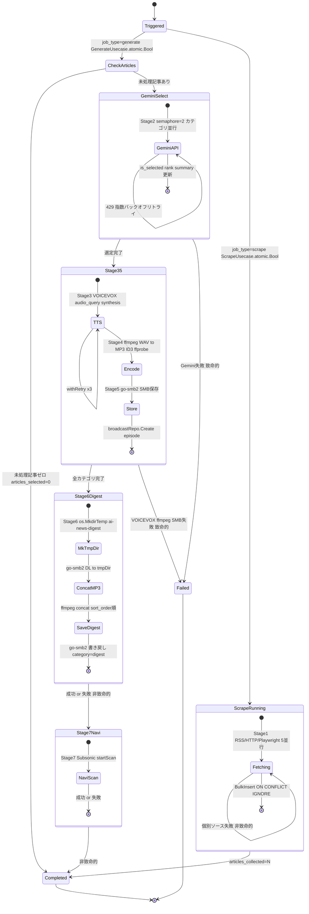

#### ScrapeJob（記事クロール専用）

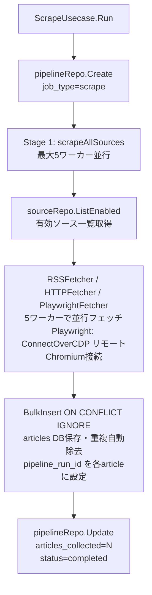

#### GenerateJob（音声生成専用）

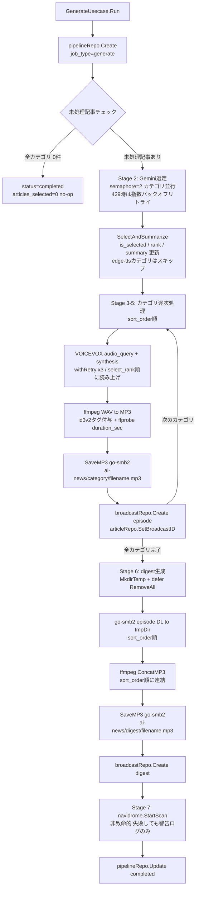

**クリーンアップ処理フロー（CleanupUsecase.DeleteOlderThan）:**

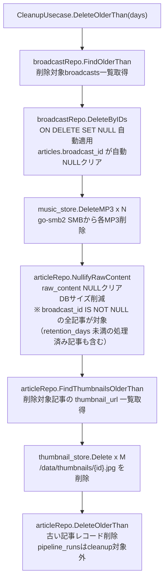

> **NullifyRawContent の対象範囲:** `broadcast_id IS NOT NULL`（処理済み）の記事全件に対して `raw_content` を NULL クリアする。`DeleteOlderThan(days)` が削除する「古い記事」と対象が重複するが、retention_days 未満の処理済み記事に対する DB サイズ削減効果があるため冗長ではない。

**GenerateJob 実行シーケンス:**

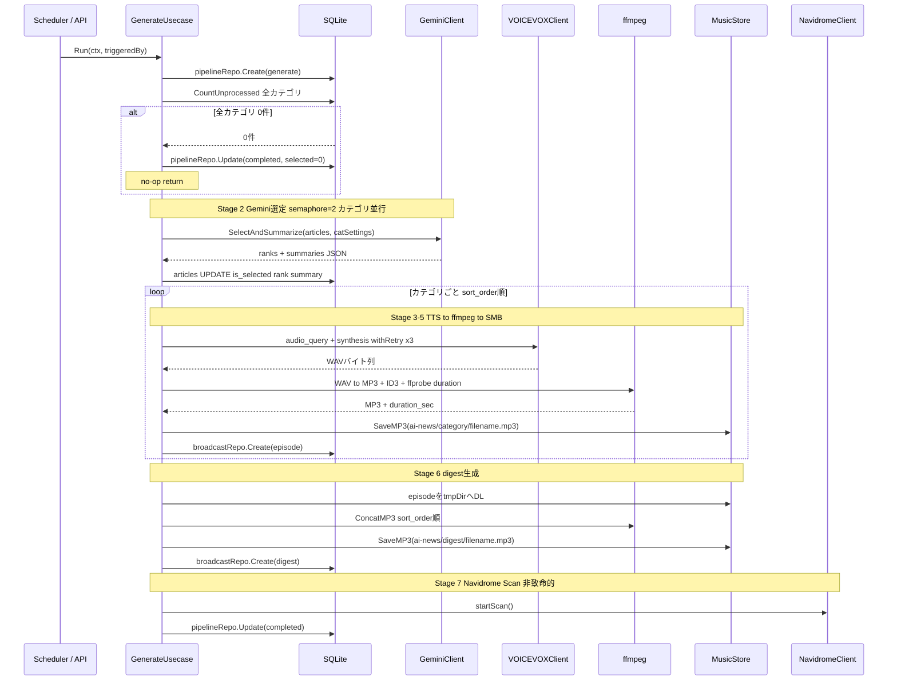

**エラーポリシー:**

| 失敗箇所 | 致命度 | 対応 |
|---|---|---|
| 個別ソースのスクレイプ失敗 | 非致命的 | ログ警告、他ソースで継続 |
| Gemini API失敗 | 致命的 | ランを失敗として記録 |
| edge-tts未実装カテゴリ | 非致命的 | 当該カテゴリをスキップ、error_messageに警告追記 |
| VOICEVOX失敗 | 致命的 | 指数バックオフ3リトライ後に失敗 |
| ffmpeg変換失敗 | 致命的 | ランを失敗として記録 |
| digest生成失敗 | 非致命的 | ログ警告（カテゴリ別episodeはSambaに保存済みなので損失なし）・tmpDirはdeferで自動削除 |
| Navidrome Scan失敗 | 非致命的 | ログ警告、UIから手動再実行可 |
| HA API逆コール失敗 | 非致命的 | ログ警告、MP3はSambaに保存済みなので損失なし |
| Sambaストレージ書き込み失敗 | 致命的 | ランを失敗として記録 |
| GenerateJob 処理対象記事ゼロ | 非致命的 | status='completed' articles_selected=0 でno-op記録 |

**データライフサイクル:**

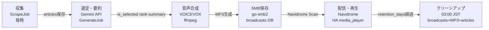

### 4-3. 音声再生フロー

GoアプリはOS execでの再生は行わない。HAが物理再生の責任を持つ。

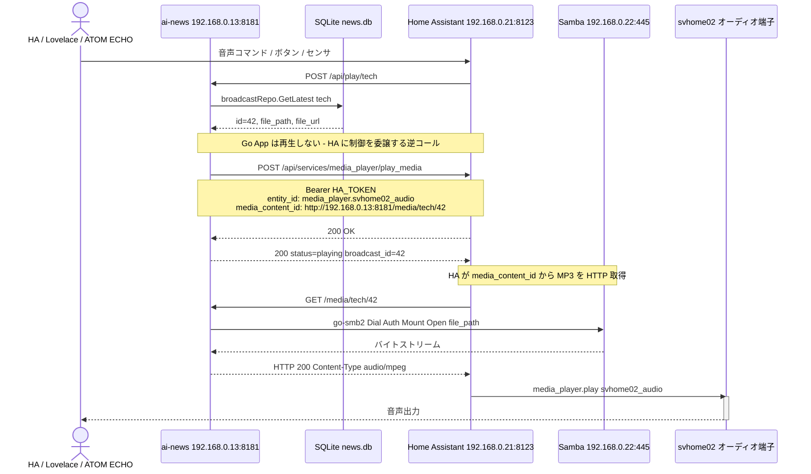

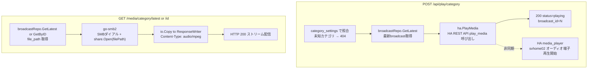

### 4-4. グレースフルシャットダウン

```
SIGINT/SIGTERM受信
 → http.Server.Shutdown(30秒タイムアウト)  # 処理中リクエストを完了待機
 → scheduler.Stop().Done()               # 実行中cronジョブの完了を待機
```

### 4-5. Docker Compose 構成の要点

**配置場所:**
- HOST SSD経由: `ssh svhome01-docker` で `/opt/stacks/ai-news/` としてアクセス
- `/opt/stacks/` はHOST SSD (`/mnt/app_data/docker/`) の bind mount。docker-lxcの32GB local-lvmを消費しない

※ HOST/LXCのシステム変更不要。go-smb2がSMBクライアントとして直接Samba共有へ接続するため、cifs-utils・fstab・pct set mp1 は一切不要。

**コンテナネットワーク構成:**

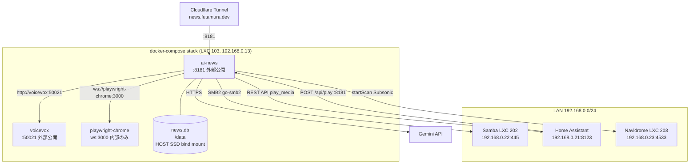

```yaml
# /opt/stacks/ai-news/docker-compose.yml
# (/opt/stacks/ は svhome01 HOST SSD の bind mount経由。local-lvm非消費)

services:
  ai-news:
    build:
      context: .
      dockerfile: Dockerfile
    container_name: ai-news
    ports:
      - "8181:8181"                              # 8080はLXC 103内のScrutiny Hubが使用中
    environment:
      - PORT=8181
      - GEMINI_API_KEY=${GEMINI_API_KEY}
      - VOICEVOX_URL=http://voicevox:50021
      - NAVIDROME_URL=http://192.168.0.23:4533
      - NAVIDROME_USER=${NAVIDROME_USER}
      - NAVIDROME_PASS=${NAVIDROME_PASS}
      - HA_URL=http://192.168.0.21:8123
      - HA_TOKEN=${HA_TOKEN}
      - HA_MEDIA_PLAYER=${HA_MEDIA_PLAYER}       # HAで実際に使うmedia_playerエンティティ名
      - APP_BASE_URL=http://192.168.0.13:8181    # HA逆コール用LAN URL (broadcasts.file_url に使用)
                                                  # Web UIのaudioタグURLはリクエストHostヘッダから動的生成
      - SMB_HOST=192.168.0.22                    # svhome02 Samba サーバーIP
      - SMB_USER=${SMB_USER}                     # Samba認証ユーザー
      - SMB_PASS=${SMB_PASS}                     # Samba認証パスワード
      - SMB_SHARE=Music                          # Samba共有名 (//192.168.0.22/Music)
      - SMB_MUSIC_PATH=ai-news                   # 共有内のMP3保存先パス prefix
      - DB_PATH=/data/news.db                    # コンテナ内パス (volumes で /data にマウント済み)
      - PLAYWRIGHT_CDP_ENDPOINT=ws://playwright-chrome:3000  # Playwright リモートChromium接続先
      - MAX_GEMINI_CONCURRENCY=2                 # Gemini並列呼び出し上限（レート制限対策）
      - TZ=Asia/Tokyo
    volumes:
      # SQLite DB: HOST SSD経由でLXC 103にbind mount済み (/opt/stacks/ai-news/data/)
      - /opt/stacks/ai-news/data:/data
      # Samba音楽共有: GoアプリがSMBクライアント(go-smb2)で直接書き込み・読み出し → volumeマウント不要
    restart: unless-stopped
    depends_on:
      voicevox:
        condition: service_healthy              # healthcheck が healthy になるまで待機
      playwright-chrome:
        condition: service_started             # 起動確認のみ（CDP接続はfetcher実行時に動的確立）

  voicevox:
    image: voicevox/voicevox_engine:cpu-ubuntu20.04-0.21.0  # latestは避けバージョン固定
    container_name: voicevox
    ports:
      - "50021:50021"
    restart: unless-stopped
    healthcheck:
      test: ["CMD-SHELL", "wget -qO- http://localhost:50021/version || exit 1"]
      interval: 10s
      timeout: 5s
      retries: 12                              # 最大2分待機（モデルロードに約30秒）
      start_period: 30s

  playwright-chrome:
    image: ghcr.io/browserless/chromium:latest  # CDP WebSocketエンドポイントを提供 ※latestは避けバージョン固定推奨（デプロイ前に最新タグを確認してピン留めする）
    container_name: playwright-chrome            # ai-newsコンテナからのみアクセス
    environment:
      - TIMEOUT=30000                          # ページ取得タイムアウト(ms)
      - MAX_CONCURRENT_SESSIONS=2             # 同時セッション数上限
      # TOKEN 環境変数は設定しない（未設定 = 認証なし）
      # ※ TOKEN= と空文字列設定はバージョンによって挙動が異なるため、未設定を明示
    restart: unless-stopped
    # ポート外部公開なし（ai-news コンテナからのみ ws://playwright-chrome:3000 でアクセス）

# Named volumeセクションなし（Samba書き込み・読み出しはGoアプリのgo-smb2クライアントが直接担当）
```

**Dockerfile と entrypoint.sh（SQLite書き込み権限対策）:**

`/opt/stacks/ai-news/data:/data` のbind mountではHOSTディレクトリの所有者（root）とコンテナ内アプリユーザーのUID/GIDが不一致になり、SQLite WALファイルの書き込み時にパーミッションエラーが発生する場合がある。`entrypoint.sh` で起動時に `/data` の所有者を実行ユーザーに合わせることで解決する。

Playwright依存（Chromiumバイナリ・システムライブラリ）は `playwright-chrome` コンテナに分離済みのため、`ai-news` コンテナのDockerfileにブラウザ関連の依存は不要。migrations は `//go:embed` でバイナリに同梱済みのため `COPY` は不要。

```bash
#!/bin/sh
# entrypoint.sh — 起動時パーミッション修正 → アプリ起動
set -e
# /data の所有者を現在のユーザーに変更（bind mountでroot所有になっている場合の対策）
chown -R "$(id -u):$(id -g)" /data 2>/dev/null || true
exec "$@"
```

```dockerfile
# Dockerfile (抜粋)
FROM golang:1.22-bookworm AS builder
WORKDIR /app
COPY go.mod go.sum ./
RUN go mod download
COPY . .
RUN CGO_ENABLED=0 go build -o ai-news ./cmd/server

FROM debian:bookworm-slim AS runtime
# ffmpeg: WAV→MP3変換 + digest連結 + ffprobeによるduration取得に必要
# wget: VOICEVOXヘルスチェック用
# ca-certificates: HTTPS通信（Gemini API等）に必要
# ※ PlaywrightのChromium依存は playwright-chrome コンテナに分離済み → 追加不要
RUN apt-get update && apt-get install -y --no-install-recommends \
    ffmpeg wget ca-certificates && rm -rf /var/lib/apt/lists/*
WORKDIR /app
COPY --from=builder /app/ai-news ./
COPY --from=builder /app/entrypoint.sh ./
COPY --from=builder /app/templates ./templates
# ※ migrations は //go:embed でバイナリ同梱済みのため COPY 不要
RUN chmod +x entrypoint.sh
EXPOSE 8181
ENTRYPOINT ["./entrypoint.sh"]
CMD ["./ai-news"]
```

> **ポイント:** `chown -R "$(id -u):$(id -g)"` はコンテナ内の実行ユーザーのUID/GIDを動的に取得するため、`--user` オプションで任意のUID指定にも対応。`|| true` で `/data` が存在しない場合もエラーにならず冪等に動作。`modernc.org/sqlite` はCGO不要のため `CGO_ENABLED=0` でクロスコンパイル可。digest生成の一時ファイルはコンテナの `/tmp` 下に `os.MkdirTemp` で生成し、`defer os.RemoveAll` により成功・失敗問わず自動削除。

**ディレクトリ初期化とデプロイ（docker-lxc内で実行）:**
```bash
# ssh svhome01-docker で接続後（/opt/stacks/ はHOST SSD bind mount経由でアクセス可能）

# データ永続化ディレクトリを作成
mkdir -p /opt/stacks/ai-news/data
chmod 755 /opt/stacks/ai-news/data

# アプリソースコードをclone（GitリポジトリURLが確定後）
git clone <REPO_URL> /opt/stacks/ai-news/

# .envファイルを作成・編集
cp /opt/stacks/ai-news/.env.example \
   /opt/stacks/ai-news/.env
# → vi /opt/stacks/ai-news/.env で各値を設定

# 起動（Scrutinyと同じパターン）
cd /opt/stacks/ai-news
docker compose up -d --build
```

---

## 5. Cloudflare Tunnel / Access 設定

管理画面を `https://news.futamura.dev` で公開するために必要な設定。

### Cloudflare Tunnel 設定 (svhome01 LXC 101)

```yaml
# /etc/cloudflared/config.yml に追記（既存エントリの先頭に挿入）
ingress:
  - hostname: news.futamura.dev
    service: http://192.168.0.13:8181           # AI News Station (LXC 103)
  # 既存エントリ（変更不要）
  - hostname: scrutiny.futamura.dev
    service: http://192.168.0.13:8080           # Scrutiny Hub on LXC 103 (既存・そのまま維持)
  - hostname: portainer.futamura.dev
    service: http://192.168.0.13:9000
  # ... 他の既存エントリ ...
  - service: http_status:404
```

### Cloudflare Access

`*.futamura.dev` 全体をカバーする既存の `Private Services (Default)` ワイルドカードポリシーが `news.futamura.dev` にも自動適用されるため、新規 Application / Policy の作成は不要。

**作業内容（Tunnel Ingress追加とDNS CNAMEのみ）:**
1. Tunnel Ingressルール追加（上記 `config.yml` の通り）: `news.futamura.dev → http://192.168.0.13:8181`
2. Cloudflare DNS: `news.futamura.dev` のCNAMEレコードを追加（`<tunnel-id>.cfargotunnel.com` 宛て）

> **注**: HA → GoアプリへのAPI呼び出し (`/api/play/*`, `/api/pipeline/*`) はLAN内通信 (192.168.0.13) のため、Cloudflare Accessを経由しない。Cloudflare Accessは外部からのWeb UI (`https://news.futamura.dev`) アクセスのみに適用。

---

## 変更対象ファイル（新規作成）

全ファイルが新規作成。既存インフラとの統合ポイント:

| 統合先 | 接続方法 | 作業内容 | 注意点 |
|---|---|---|---|
| LXC 101 (Cloudflare Tunnel + DNS) | `ssh svhome01` → `pct enter 101` | `config.yml` に `news.futamura.dev → :8181` エントリ追加・`systemctl restart cloudflared`・CloudflareダッシュボードでCNAMEレコード追加 | `scrutiny.futamura.dev → :8080` の既存エントリを絶対に消さない。Access Applicationの新規作成不要（既存 `*.futamura.dev` ワイルドカードポリシーで自動適用） |
| LXC 103 (Docker) | `ssh svhome01-docker` | `/opt/stacks/ai-news/` にgit clone・`.env`（SMB_HOST/SMB_USER/SMB_PASS等）設定・`docker compose up -d --build` | ポート **8181** を使用。HOST/LXCのシステム変更不要（SMB書き込み・読み出しはgo-smb2が直接担当） |
| Home Assistant (svhome02) | ブラウザ: http://192.168.0.21:8123 | 長期アクセストークン発行・`rest_command`設定・オートメーション設定 | `HA_MEDIA_PLAYER` の実際のエンティティ名をHAの設定から確認 |
| Navidrome (svhome02) | 設定変更不要 | ai-news フォルダを音楽ライブラリとして自動認識 | `//192.168.0.22/Music/ai-news/` に保存→Navidrome自動検出 |

---

## 検証方法

**全ての動作確認はSSH経由で実施。docker-lxc作業は `ssh svhome01-docker`、Proxmoxホスト作業は `ssh svhome01`、svhome02作業は `ssh svhome02` を使用。**

1. **ユニットテスト** (`ssh svhome01-docker`)
   ```bash
   cd /opt/stacks/ai-news
   go test ./internal/...
   ```

2. **コンテナ起動確認** (`ssh svhome01-docker`)
   ```bash
   cd /opt/stacks/ai-news
   docker compose ps
   docker compose logs --tail=50 ai-news
   docker compose logs --tail=20 playwright-chrome
   ```

3. **パイプライン手動実行** (curlはLXC 103内またはLAN内PCから)
   ```bash
   curl -X POST http://192.168.0.13:8181/api/pipeline/run
   # → {"run_id":1,"status":"running"}
   curl http://192.168.0.13:8181/api/pipeline/1
   # → {"status":"completed","articles_collected":30,"articles_selected":10}
   ```

4. **MP3ファイル生成確認** (`ssh svhome02` でSamba共有元を確認)
   ```bash
   ls -la /mnt/media_data/music/ai-news/tech/
   ls -la /mnt/media_data/music/ai-news/business/
   ```

5. **音声再生テスト** (curlまたはHAの開発者ツールから)
   ```bash
   curl -X POST http://192.168.0.13:8181/api/play/tech
   # → HA media_playerにコマンド送信 → svhome02オーディオ端子から再生
   curl -X POST http://192.168.0.13:8181/api/play/unknown-category
   # → 404 （未知カテゴリは拒否されることを確認）
   ```

6. **メディア配信テスト** (ブラウザまたはcurlで)
   ```
   http://192.168.0.13:8181/media/tech/latest
   # go-smb2経由でSMBから読み出しストリーム配信されることを確認
   ```

7. **Navidrome確認** (ブラウザ)
   ```
   http://192.168.0.23:4533  → ai-news アルバムが表示されること
   ```

8. **Web UI確認** (ブラウザ・LAN内)
   ```
   http://192.168.0.13:8181       # LAN内アクセス
   https://news.futamura.dev      # Cloudflare Tunnel + Access経由
   ```

9. **GenerateJob no-op確認** (`ssh svhome01-docker`)
   ```bash
   # 前提: broadcastsにレコードが存在すること（存在しない場合は先にgenerate jobを1回実行）
   sqlite3 /opt/stacks/ai-news/data/news.db "SELECT COUNT(*) FROM broadcasts;"
   # → 1以上であることを確認（0の場合はstep 3を先に実行してbroadcastを作成する）

   # 存在するbroadcast idを確認してからarticlesを処理済みにする
   sqlite3 /opt/stacks/ai-news/data/news.db \
     "UPDATE articles SET broadcast_id=(SELECT id FROM broadcasts LIMIT 1)
      WHERE broadcast_id IS NULL;"
   curl -X POST "http://192.168.0.13:8181/api/pipeline/run?job_type=generate"
   # → status='completed', articles_selected=0 のno-op runが記録されることを確認
   ```

10. **クリーンアップテスト** (`ssh svhome01-docker`)
    ```bash
    # broadcastsのcreated_atを保持日数より古い日付に書き換えてテスト
    sqlite3 /opt/stacks/ai-news/data/news.db \
      "UPDATE broadcasts SET created_at = datetime('now', '-8 days');"
    # クリーンアップをUIから手動実行
    curl -X POST http://192.168.0.13:8181/ui/system/cleanup
    # broadcasts削除後にarticles.broadcast_idがNULLになることを確認（ON DELETE SET NULL）
    sqlite3 /opt/stacks/ai-news/data/news.db \
      "SELECT COUNT(*) FROM articles WHERE broadcast_id IS NULL;"
    # SMB上のファイルが削除されていることを svhome02 で確認
    ssh svhome02 ls /mnt/media_data/music/ai-news/
    ```

11. **予約語バリデーション確認** (curlで)
    ```bash
    # "stop" カテゴリの作成が拒否されることを確認
    curl -X POST http://192.168.0.13:8181/ui/categories \
      -d "category=stop&display_name=Test"
    # → 400 Bad Request（ルーティング予約語のため拒否）
    # "digest" カテゴリの作成が拒否されることを確認
    curl -X POST http://192.168.0.13:8181/ui/categories \
      -d "category=digest&display_name=Test"
    # → 400 Bad Request（システム予約語のため拒否）
    ```

